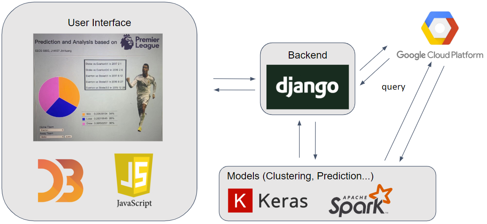

# Prediction-and-Analysis-Based-on-English-Premier-League

The English Premier is the top level of the English football league system. The goal of our work is to provide a system that has the function of Player Play-style Clustering, Player Influence Analysis, Team Performance Prediction, and Match Result Prediction.

## System Overview
The image below shows the overview of our system. 


We used Google Cloud Platform (GCP) to store raw data and the preprocessed data and used Pyspark to process the csv data into RDD and do mapping and filtering for out feature extraction. For the prediction and classification models, we tried several tools: Keras, Scikit-learn, XGboost. We used Keras to build the LSTM model for performance prediction, and also the MLP model for match result classification. Scikit-learn was used to do several data preprocessing including one hot encoding, testing data splitting, and standard scaler. We also utilized the Random Forest classifier in Scikit-learn. 

## Code Usage
For model comparing
```
python main.py compare [model] [method]
```
Available models: MLP, Forest, SVM, XGB, MLP <br>
Available methods: player, team

For prediction
```
python main.py predict
```
For clustering
```
python main.py cluster
```
